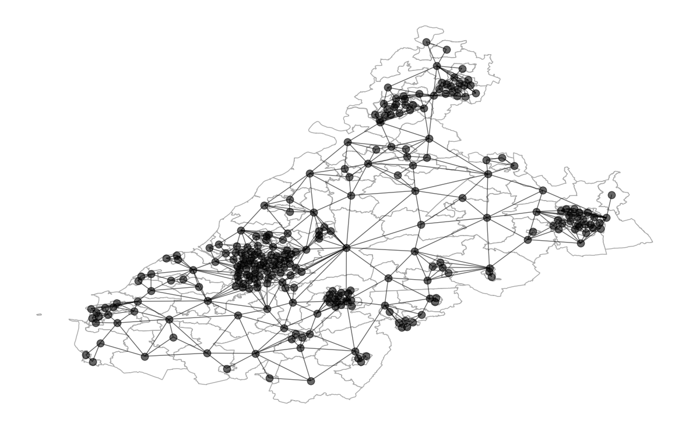
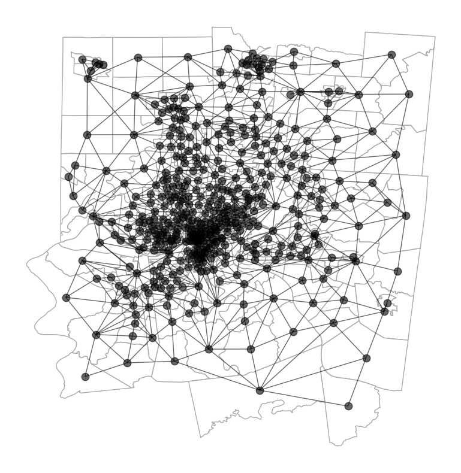
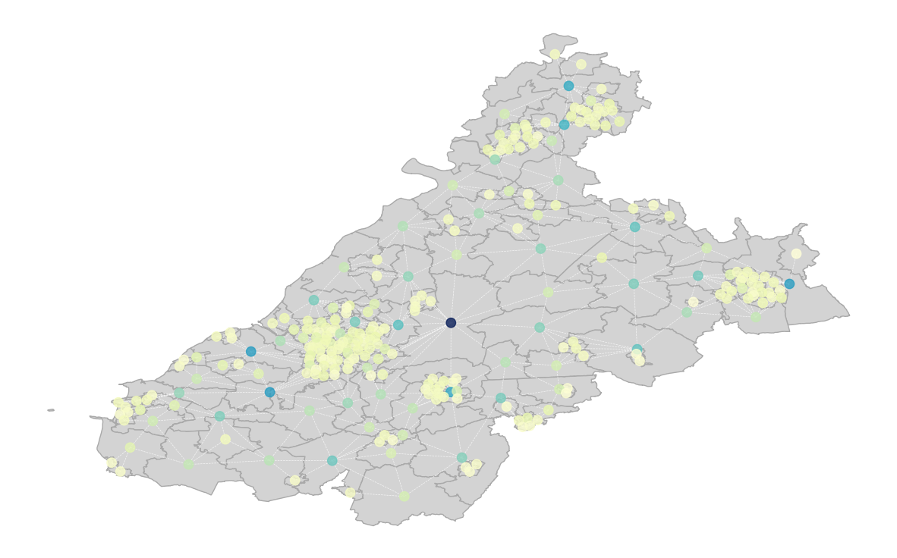
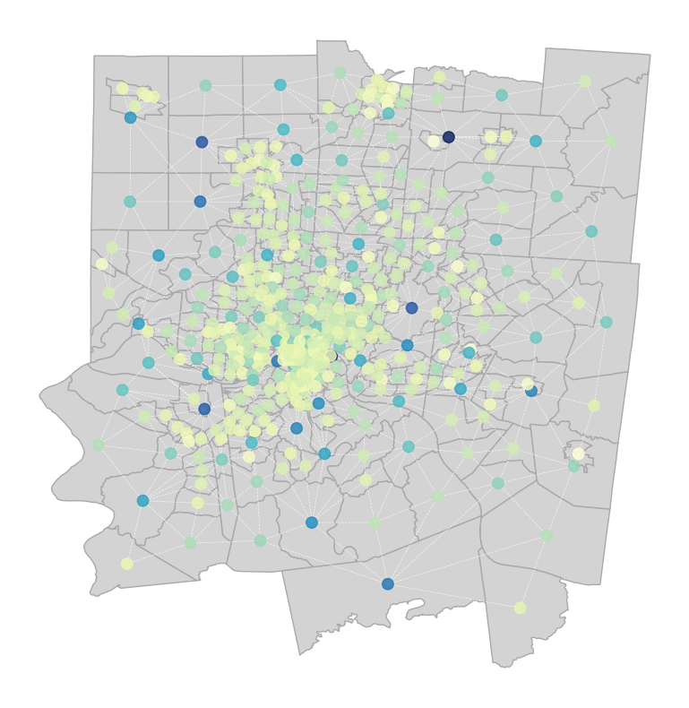
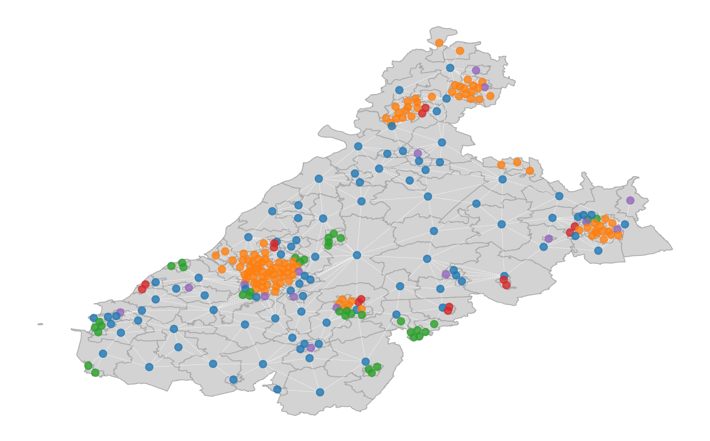
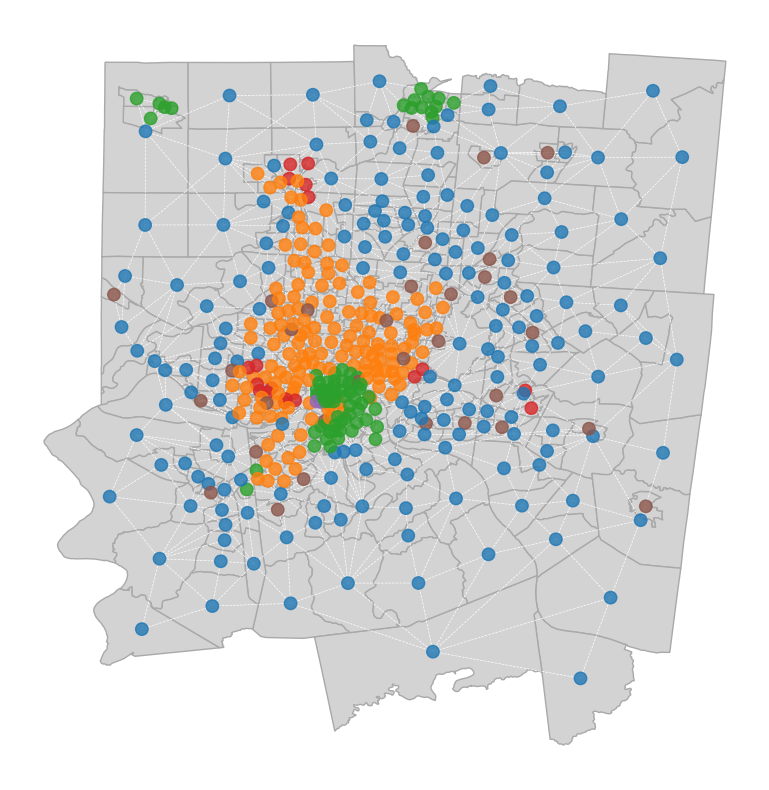

# :car: Traffic Flow Analysis Using Uber Movement Data 🔎
The proposed work presents a study of traffic flow in two cities (Bristol and Cincinnati) based on the *Movement dataset* provided by *Uber*. For each city, a temporal network defining the mean travel times during weekdays at different hours is provided along with a spatial graph defining the city structure.

  | Spatial Network of Bristol              | Spatial Network of Cincinnati          |
  |:---------------------------------------:|:--------------------------------------:|
  |             |         |

The analysis is divided into two steps. Firstly, node centrality is computed in order to investigate traffic behavior throughout different times of the day in comparison to the topographic structure of the cities. Next, community detection is applied to identify travel clusters and regions with similar characteristics.

  | Example of Centrality results on Bristol | Example of Centrality results on Cincinnati |
  |:----------------------------------------:|:-------------------------------------------:|
  |   |   |
  
  | Example of Community Detection results on Bristol   | Example of Community Detection results on Cincinnati   |
  |:---------------------------------------------------:|:------------------------------------------------------:|
  |     |     |

Data can be downloaded from the [*Uber Movement*](https://movement.uber.com/) website, considering for Bristol and Cincinnati:
- The `Travel Times by Hour of Day (Weekdays Only)` of `2020 Quarter 1` file in the section `ALL DATA`;
- The file in the section `GEO BOUNDARIES`.

## Dependencies
- [GeoPandas](https://geopandas.org/en/stable/index.html)
- [Matplotlib](https://pypi.org/project/matplotlib/)
- [NetworkX](https://networkx.org/documentation/stable/reference/index.html)
- [NumPy](https://pypi.org/project/numpy/)
- [Scikit-learn](https://scikit-learn.org/stable/index.html)
- [Shapely](https://shapely.readthedocs.io/en/stable/manual.html)
- [Pandas](https://pypi.org/project/pandas/)

## Repository structure

    .
    ├── doc
    │   └── report.pdf                                    # Project report.
    ├── img                                               # Directory containing source images used in README.md.
    ├── src
    │   ├── results                                       # Directory contining results of the Community Detection algorithms.
    │   ├── utils
    │   │   ├── core.py                                   # Python module implementing weighted k-core.
    │   │   ├── geodataframe.py                           # Python module to obtain the geodataframe from the GEOJSON data.
    │   │   ├── graphics.py                               # Python module used to plot graphical results.
    │   │   ├── hits.py                                   # Python module implementing HITS centrality.
    │   │   ├── k_clique.py                               # Python module implementing weighted k-clique.
    │   │   ├── metrics.py                                # Python module defining interfaces to apply centrality or community detection metrics.
    │   │   ├── spatial_network.py                        # Python module to build the spatial network.
    │   │   └── temporal_network.py                       # Python module to build the temporal network.
    │   ├── Traffic Flow Analysis of Bristol.ipynb        # Notebook illustrating the traffic flow analysis process on Bristol.
    │   ├── Traffic Flow Analysis of Cincinnati.ipynb     # Notebook illustrating the traffic flow analysis process on Cincinnati.
    ├── .gitignore
    ├── LICENSE
    └── README.md

## Versioning

Git is used for versioning.

## Group members

|      Name       |     Surname     |                 Email                  |                        Username                         |
| :-------------: | :-------------: | :------------------------------------: | :-----------------------------------------------------: |
| Mohammad Reza   | Ghasemi Madani  | `mohammadreza.ghasemi@studio.unibo.it` | [_qasemii_](https://github.com/qasemii)                 |
| Riccardo        | Spolaor         | `riccardo.spolaor@studio.unibo.it`     | [_RiccardoSpolaor_](https://github.com/RiccardoSpolaor) |

## License

This project is licensed under the MIT License - see the [LICENSE](LICENSE) file for details.
